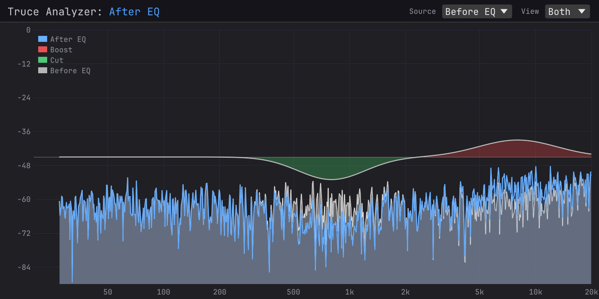

# truce

Build audio plugins in Rust. CLAP, VST3, LV2, AU v2, AU v3,
AAX, and standalone from a single Rust codebase.

[](https://github.com/truce-audio/truce/actions/workflows/ci-macos.yml)
[](https://github.com/truce-audio/truce/actions/workflows/ci-windows.yml)
[](https://github.com/truce-audio/truce/actions/workflows/ci-linux.yml)
[](LICENSE)

## Quick Start

```sh
# Install the CLI (one-time)
cargo install --git https://github.com/truce-audio/truce cargo-truce

# Scaffold a new plugin
cargo truce new my-plugin
cd my-plugin

# Run the plugin standalone — no DAW needed
cargo truce run

# Build and install (CLAP by default)
cargo truce install --clap

# Open your DAW, scan for plugins, load "MyPlugin"
```

Other formats:

```sh
cargo truce install              # formats in your plugin's default features
cargo truce install --vst3       # VST3
cargo truce install --vst2       # VST2 (opt-in, legacy — see note below)
cargo truce install --lv2        # LV2
cargo truce install --au3        # AU v3 (macOS, requires Xcode)
cargo truce install --aax        # AAX (requires AAX SDK)

cargo truce validate             # auval + pluginval + clap-validator on installed plugins
```

Build without installing:

```sh
cargo truce build                # bundle all formats into target/bundles/ without installing
cargo truce build --clap --vst3  # subset of formats
cargo truce build --hot-reload          # hot-reload shell build (see docs/reference/hot-reload.md)

cargo truce run                  # launch the plugin standalone (no DAW)
cargo truce run -p my-plugin     # standalone for a specific crate
cargo truce test                 # run tests
cargo truce screenshot           # render every plugin's GUI to target/screenshots/
cargo truce screenshot -p my-plugin --name dark   # one plugin, custom filename
cargo truce package              # signed .pkg (macOS) or Inno Setup .exe (Windows)
                                 # → target/dist/<Plugin>-<version>-<platform>.{pkg,exe}

cargo truce package -p my-plugin --formats clap,vst3,aax   # subset
cargo truce package --no-sign                              # dev builds, skip signing
cargo truce clean                # cargo clean, preserving target/dist/ installers
```

Scaffolded plugins default to **CLAP + VST3 + standalone**. VST2, AU, and AAX are
opt-in per plugin via `Cargo.toml` features. On Windows, `cargo truce
install` must be run from an Administrator command prompt (plugin
directories are system-wide).

## Examples

[**truce-analyzer**](https://github.com/truce-audio/truce-analyzer),
a real-time spectrum analyzer with diff overlay for debugging/reverse-engineering plugins:



Nine smaller example plugins ship in-tree to cover the basics — gain,
EQ, synth, transpose, arpeggio, tremolo, plus three gain variants
showing the egui / iced / Slint backends. See
[examples/README.md](examples/README.md) for the full table with
screenshots.

## Minimal Example

```rust
use truce::prelude::*;
use truce_gui::layout::{knob, widgets, GridLayout};

#[derive(Params)]
pub struct GainParams {
    #[param(name = "Gain", range = "linear(-60, 6)",
            unit = "dB", smooth = "exp(5)")]
    pub gain: FloatParam,
}

use GainParamsParamId as P;

pub struct Gain { params: Arc<GainParams> }

impl Gain {
    pub fn new(params: Arc<GainParams>) -> Self { Self { params } }
}

impl PluginLogic for Gain {
    fn reset(&mut self, sr: f64, _bs: usize) {
        self.params.set_sample_rate(sr);
    }

    fn process(&mut self, buffer: &mut AudioBuffer, _events: &EventList,
               _ctx: &mut ProcessContext) -> ProcessStatus {
        for i in 0..buffer.num_samples() {
            let gain = db_to_linear(self.params.gain.smoothed_next() as f64) as f32;
            for ch in 0..buffer.channels() {
                let (inp, out) = buffer.io(ch);
                out[i] = inp[i] * gain;
            }
        }
        ProcessStatus::Normal
    }

    fn layout(&self) -> GridLayout {
        GridLayout::build("GAIN", "V0.1", 2, 50.0, vec![widgets(vec![
            knob(P::Gain, "Gain"),
        ])])
    }
}

truce::plugin! { logic: Gain, params: GainParams }
```

A complete plugin with smoothed params, a GPU-rendered GUI knob, and
the CLAP + VST3 + standalone defaults. Add `vst2`, `lv2`, `au`, or `aax`
to your `[features].default` to ship more formats from the same code.

## Format Support

By platform:

| Format | macOS | Windows | Linux |
|--------|-------|---------|-------|
| CLAP   | Yes   | Yes     | Yes   |
| VST3   | Yes   | Yes     | Yes   |
| VST2   | Yes   | Yes     | Yes   |
| LV2    | Yes   | Yes     | Yes   |
| AU v2  | Yes   | —       | —     |
| AU v3  | Yes   | —       | —     |
| AAX    | Yes   | Yes     | —     |

AU is macOS-only by design. LV2 is the native Linux format and also
builds on macOS and Windows — supports audio, MIDI, state, and UI
(X11UI on Linux, CocoaUI on macOS, WindowsUI on Windows). AAX
requires the Avid AAX SDK and PACE/iLok signing
for retail Pro Tools releases. VST2 is opt-in on all platforms — see
note below. See [Status](docs/status.md) for host coverage.

## Features

- **7 plugin formats** from one codebase (CLAP, VST3 default; VST2, LV2, AU v2, AU v3, AAX opt-in)
- **Cross-platform** — macOS, Windows, and Linux
- **Hot reload** — edit DSP/layout, rebuild, hear changes without restarting the DAW
- **Flexible GUI frameworks** — Built-in widgets, egui, iced, slint, or raw window handle
- **Declarative params** — `#[derive(Params)]` + `#[param(...)]` with smoothing, ranges, units
- **`truce::plugin!`** — one macro generates all format exports + GUI + state serialization
- **`cargo truce`** — scaffold, build, install, validate, package; `doctor` reports environment health
- **`cargo truce package`** — signed distributable installers on both platforms (`.pkg` with notarization on macOS; Inno Setup `.exe` with Authenticode on Windows)
- **Zero-copy audio** — format wrappers pass host buffers directly
- **Thread-safe params** — atomic storage, lock-free access from any thread
- **Automated tests** — render, state, params, GUI screenshots, binary validation
- **Automated validation** — `cargo truce validate` runs auval, pluginval, and clap-validator in one command

## Crate Structure

```
crates/
├── truce               # Facade (re-exports, plugin! macro)
├── truce-core          # Plugin, AudioBuffer, events, state
├── truce-params        # FloatParam, BoolParam, EnumParam, smoothing
├── truce-params-derive # #[derive(Params)] proc macro
├── truce-derive        # plugin_info!() + helper derives
├── truce-build         # build.rs helper (reads truce.toml)
├── truce-clap          # CLAP format wrapper
├── truce-vst3          # VST3 format wrapper
├── truce-vst2          # VST2 format wrapper (clean-room)
├── truce-lv2           # LV2 format wrapper (hand-rolled C bindings)
├── truce-aax           # AAX format wrapper
├── truce-au            # Audio Unit (v2 + v3)
├── truce-shim-types    # Shared FFI types for VST3/AAX C++ shims
├── truce-standalone    # Standalone host (cpal audio)
├── truce-gui           # Built-in GUI (7 widgets, layout DSL)
├── truce-gpu           # wgpu rendering backend for truce-gui
├── truce-dsp           # Realtime-safe DSP utilities (AudioTap SPSC ring)
├── truce-egui          # egui GUI integration
├── truce-iced          # Iced GUI integration
├── truce-slint         # Slint GUI integration
├── truce-loader        # Hot-reload (native ABI, PluginLogic trait)
├── truce-xtask         # Build/bundle/install/package library
├── truce-test          # Test utilities + GUI screenshot tests
├── cargo-truce         # `cargo truce` CLI (new, install, build, package, …)
```

## Documentation

- [Reference](docs/reference/) — install, first plugin, params, processing, GUI, hot reload, shipping
- [Formats](docs/formats/) — per-format reference (CLAP, VST3, VST2, LV2, AU, AAX) with env vars, signing, install paths, gotchas
- [Status](docs/status.md) — what's built, what's next

## Configuration

Plugin metadata lives in `truce.toml`:

```toml
[vendor]
name = "My Company"
id = "com.mycompany"
au_manufacturer = "MyCo"

[[plugin]]
name = "My Effect"
bundle_id = "effect"
crate = "my-effect"
category = "effect"
fourcc = "MyFx"
```

## Requirements

- Rust 1.88+ (`rustup update`).
- **macOS**: Xcode CLI tools (`xcode-select --install`). Full Xcode for AU v3.
- **Windows**: MSVC build tools (Visual Studio 2019+ with the "Desktop
  development with C++" workload). Rust `x86_64-pc-windows-msvc`
  toolchain is required.
- **Linux**: X11 + Vulkan development headers and JACK (via the PipeWire
  shim on modern distros). 
- AAX: Avid AAX SDK (optional, obtain from [developer.avid.com](https://developer.avid.com)).

## License

MIT OR Apache-2.0
