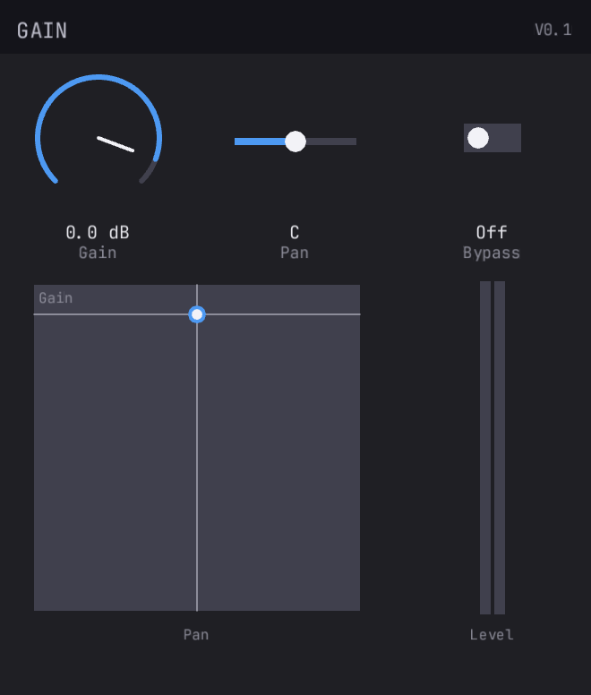
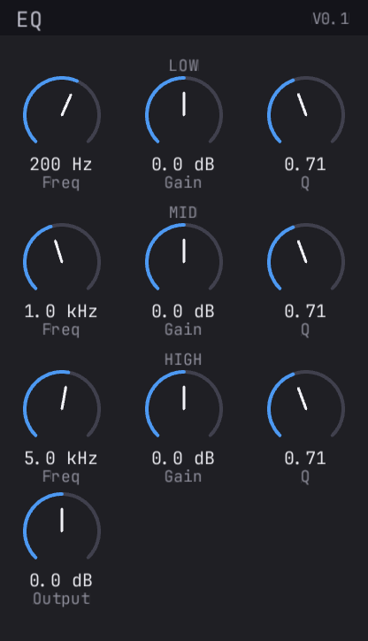
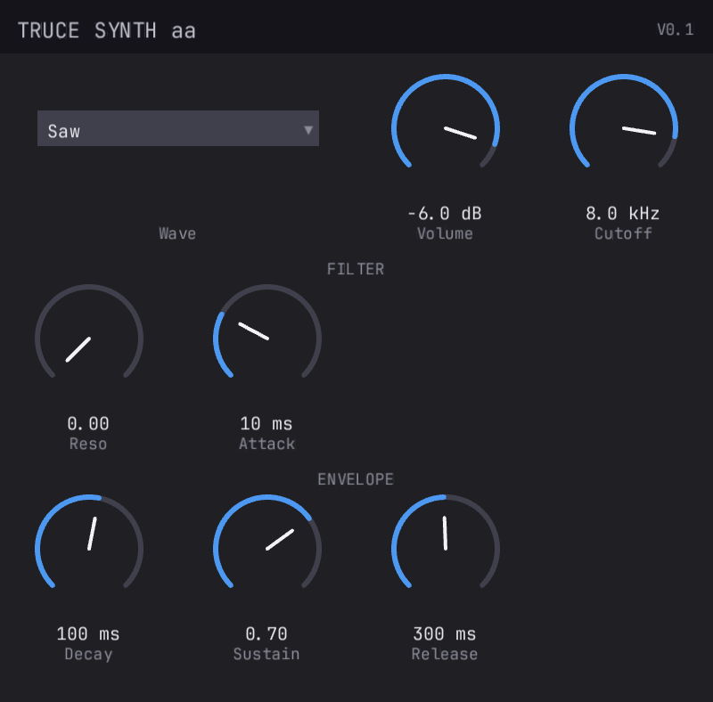
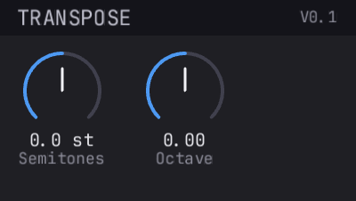
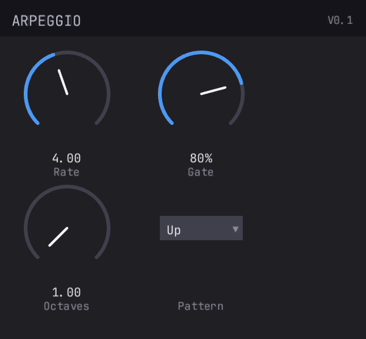
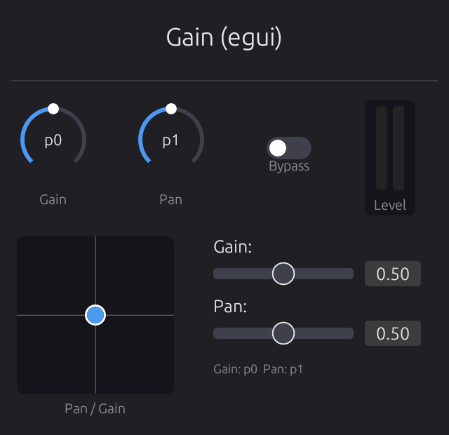
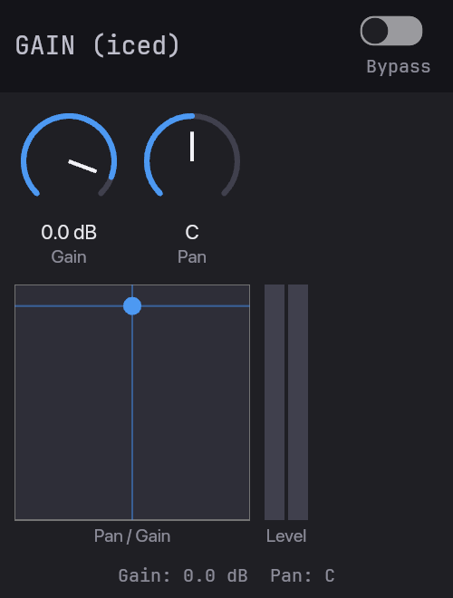
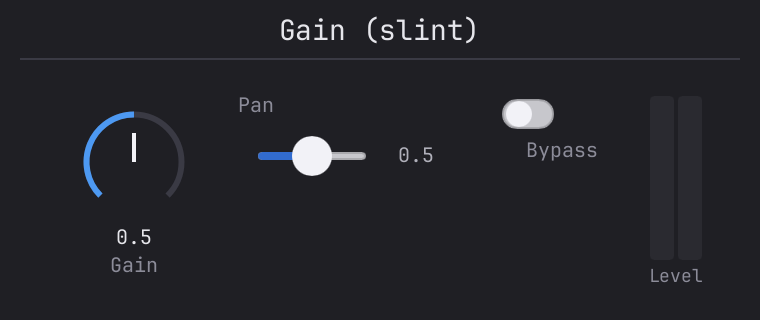

# truce

Build audio plugins in Rust. One codebase, every format.

[](LICENSE)

Write your plugin once. Build CLAP, VST3, VST2, AU v2, AU v3, AAX,
and standalone from a single Rust codebase. Hot-reload DSP and GUI
changes without restarting the DAW. Runs on **macOS** and **Windows**
(Linux support planned).

## Quick Start

```sh
# Install the CLI (one-time)
cargo install --git https://github.com/truce-audio/truce cargo-truce

# Scaffold a new plugin
cargo truce new my-plugin
cd my-plugin

# Build and install (CLAP by default)
cargo truce install --clap

# Open your DAW, scan for plugins, load "MyPlugin"
```

Other formats:

```sh
cargo truce install              # formats in your plugin's default features
cargo truce install --vst3       # VST3
cargo truce install --vst2       # VST2 (opt-in, legacy — see note below)
cargo truce install --au3        # AU v3 (macOS, requires Xcode)
cargo truce install --aax        # AAX (requires AAX SDK)
cargo truce test                 # run tests
cargo truce validate             # auval + pluginval + clap-validator
```

Scaffolded plugins default to **CLAP + VST3**. VST2, AU, and AAX are
opt-in per plugin via `Cargo.toml` features. On Windows, `cargo truce
install` must be run from an Administrator command prompt (plugin
directories are system-wide).

## Minimal Example

```rust
use truce::prelude::*;

#[derive(Params)]
pub struct GainParams {
    #[param(name = "Gain", range = "linear(-60, 6)",
            unit = "dB", smooth = "exp(5)")]
    pub gain: FloatParam,
}

pub struct Gain { params: Arc<GainParams> }

impl Gain {
    pub fn new(params: Arc<GainParams>) -> Self { Self { params } }
}

impl PluginLogic for Gain {
    fn reset(&mut self, sr: f64, _bs: usize) {
        self.params.set_sample_rate(sr);
    }

    fn process(&mut self, buffer: &mut AudioBuffer, _events: &EventList,
               _ctx: &mut ProcessContext) -> ProcessStatus {
        for i in 0..buffer.num_samples() {
            let gain = db_to_linear(self.params.gain.smoothed_next() as f64) as f32;
            for ch in 0..buffer.channels() {
                let (inp, out) = buffer.io(ch);
                out[i] = inp[i] * gain;
            }
        }
        ProcessStatus::Normal
    }

    fn layout(&self) -> GridLayout {
        GridLayout::build("GAIN", "V0.1", 2, 50.0, vec![widgets(vec![
            knob(0, "Gain"),
        ])])
    }
}

truce::plugin! { logic: Gain, params: GainParams }
```

One import. One trait. One macro. That's a complete plugin with
smoothed params, a GPU-rendered GUI knob, and CLAP + VST3 + AU exports.

## Hot Reload

Edit DSP or layout code, rebuild, hear the change in ~2 seconds.
No DAW restart. Same crate, same code — just a feature flag:

```bash
# One-time: build and install hot-reload shell
cargo truce install --dev

# Iterate: rebuild the logic dylib (debug, fast)
cargo watch -x "build -p my-plugin"
```

Zero code changes between dev and release. The `dev` feature makes
`truce::plugin!` produce a hot-reload shell; without it, everything
compiles statically with zero overhead.

**GUI hot-reload:** Built-in GUI layouts also hot-reload. Edit
`layout()`, rebuild, and the plugin window updates automatically — no
close/reopen needed, no window flash. Custom editors (egui, iced, slint)
require manual close/reopen.

## GUI Backends

The built-in GUI renders automatically from your `layout()` — no custom
code needed. For custom UIs, pick a framework:

| Backend | Crate | Best for |
|---------|-------|----------|
| Built-in | `truce-gui` | Standard UIs — zero code, knobs/sliders/meters/XY pads |
| [egui](docs/gui/egui.md) | `truce-egui` | Custom layouts, text input, third-party egui widgets |
| [Iced](docs/gui/iced.md) | `truce-iced` | Elm architecture, auto-generated or custom retained-mode UIs |
| [Slint](docs/gui/slint.md) | `truce-slint` | Declarative `.slint` markup, build-time compilation, IDE preview |
| [Raw](docs/gui/raw-window-handle.md) | `truce-core` | Full control — Metal, OpenGL, Skia, anything |

See [GUI backends](docs/gui/README.md) for detailed docs.

## Format Support

By platform:

| Format | macOS | Windows | Linux |
|--------|-------|---------|-------|
| CLAP   | Yes   | Yes     | Planned |
| VST3   | Yes   | Yes     | Planned |
| VST2   | Yes   | Yes     | Planned |
| AU v2  | Yes   | —       | —       |
| AU v3  | Yes   | —       | —       |
| AAX    | Yes   | Partial | —       |

AU is macOS-only by design. AAX template builds on Windows aren't
implemented yet. VST2 is opt-in on all platforms — see note below.

By host (macOS + Windows combined):

| Format | Reaper | Logic | GarageBand | Ableton | FL Studio | Pro Tools |
|--------|--------|-------|------------|---------|-----------|-----------|
| CLAP   | Yes    |       |            |         |           |           |
| VST3   | Yes    |       |            | Yes     | Yes       |           |
| VST2   | Yes    |       |            | Yes     | Yes       |           |
| AU v2  | Yes    | Yes   | Yes        | Yes     |           |           |
| AU v3  |        | Yes   | Yes        | Yes     |           |           |
| AAX    |        |       |            |         |           | Yes       |

> ⚠️ **VST2 is a legacy format and is opt-in per plugin.** Steinberg
> deprecated the VST2 SDK in 2018. Distributing VST2 plugins may require
> agreement with Steinberg's licensing terms. Truce's VST2 support uses
> a clean-room shim (no Steinberg SDK headers), but the VST trademark and
> logo are still Steinberg's. Enable the `vst2` feature only if you
> understand the implications.

## Examples

| Plugin | Type | GUI | Screenshot |
|--------|------|-----|-----------|
| [gain](examples/gain/) | Effect | Built-in |  |
| [eq](examples/eq/) | Effect | Built-in |  |
| [synth](examples/synth/) | Instrument | Built-in |  |
| [transpose](examples/transpose/) | MIDI | Built-in |  |
| [arpeggio](examples/arpeggio/) | MIDI | Built-in |  |
| [gain-egui](examples/gain-egui/) | Effect | egui |  |
| [gain-iced](examples/gain-iced/) | Effect | Iced |  |
| [gain-slint](examples/gain-slint/) | Effect | Slint |  |

## Features

- **6 plugin formats** from one codebase (CLAP, VST3 default; VST2, AU v2, AU v3, AAX opt-in)
- **Cross-platform** — macOS and Windows supported; Linux planned
- **Hot reload** — edit DSP/layout, rebuild, hear changes without restarting the DAW
- **Built-in GUI** — knobs, sliders, toggles, selectors, meters, XY pads (wgpu GPU rendering)
- **4 GUI frameworks** — egui, iced, slint, or raw window handle
- **Declarative params** — `#[derive(Params)]` + `#[param(...)]` with smoothing, ranges, units
- **`truce::plugin!`** — one macro generates all format exports + GUI + state serialization
- **`cargo truce`** — build, bundle, sign, install, validate, clean
- **Zero-copy audio** — format wrappers pass host buffers directly
- **Thread-safe params** — atomic storage, lock-free access from any thread
- **Automated tests** — render, state, params, GUI screenshots, binary validation
- **Automated validation** — `cargo truce validate` runs auval, pluginval, and clap-validator in one command

## Crate Structure

```
crates/
├── truce               # Facade (re-exports, plugin! macro)
├── truce-core          # Plugin, AudioBuffer, events, state
├── truce-params        # FloatParam, BoolParam, EnumParam, smoothing
├── truce-params-derive # #[derive(Params)] proc macro
├── truce-build         # build.rs helper (reads truce.toml)
├── truce-clap          # CLAP format wrapper
├── truce-vst3          # VST3 format wrapper
├── truce-vst2          # VST2 format wrapper (clean-room)
├── truce-aax           # AAX format wrapper
├── truce-au            # Audio Unit (v2 + v3)
├── truce-standalone    # Standalone host (cpal audio)
├── truce-gui           # Built-in GUI (wgpu GPU rendering, 6 widgets)
├── truce-gpu           # wgpu backend for built-in GUI
├── truce-egui          # egui GUI integration
├── truce-iced          # Iced GUI integration
├── truce-slint         # Slint GUI integration
├── truce-loader        # Hot-reload (native ABI, PluginLogic trait)
├── truce-xtask         # Build/bundle/install library
├── truce-test          # Test utilities + GUI snapshot tests
├── cargo-truce         # Scaffolding CLI (cargo truce new)
```

## Documentation

- [Quickstart](docs/quickstart.md) — zero to hearing your plugin in 5 minutes
- [Tutorials](docs/reference/) — parameters, processing, synth, GUI, hot reload
- [GUI Backends](docs/gui/README.md) — egui, iced, slint, raw window handle
- [Layout](docs/layout.md) — grid layouts, widget reference
- [Screenshot Testing](docs/gui/screenshot-testing.md) — headless GUI regression tests
- [Comparisons](docs/comparisons.md) — truce vs JUCE vs nih-plug
- [Status](docs/status.md) — what's built, what's next

## Configuration

Plugin metadata lives in `truce.toml`:

```toml
[vendor]
name = "My Company"
id = "com.mycompany"
au_manufacturer = "MyCo"

[[plugin]]
name = "My Effect"
suffix = "effect"
crate = "my-effect"
category = "effect"
au_subtype = "MyFx"
```

## Requirements

- Rust 1.75+ (`rustup update`). Slint integration requires 1.88+.
- **macOS**: Xcode CLI tools (`xcode-select --install`). Full Xcode for AU v3.
- **Windows**: MSVC build tools (Visual Studio 2019+ with the "Desktop
  development with C++" workload). Rust `x86_64-pc-windows-msvc`
  toolchain is required. 
- AAX: Avid AAX SDK (optional, obtain from [developer.avid.com](https://developer.avid.com)).

## License

MIT OR Apache-2.0
