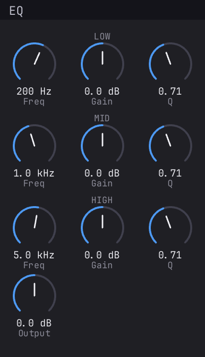
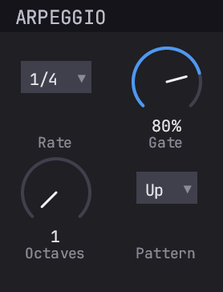
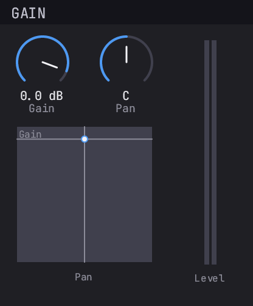
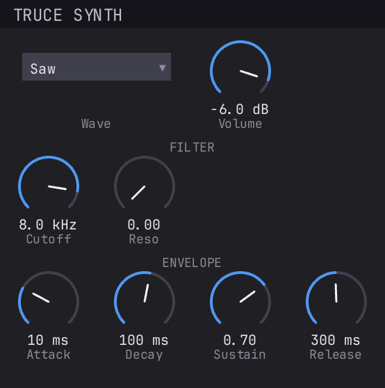
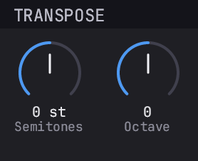
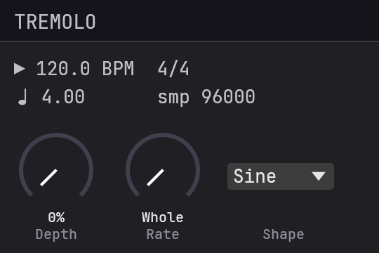

<p align="center">
  <a href="https://truce.audio/"></a>
  <br/>
  <a href="https://truce.audio/"><b>https://truce.audio</b></a>
</p>

<p align="center">
  Build audio plugins in Rust. VST3, CLAP, AU v2, AU v3 (macOS + iOS), 
  AAX (Pro Tools), and standalone from a single Rust codebase. 
  Dead simple developer experience: in 5 minutes, you can load
  your own plugin in a DAW and test your custom DSP, MIDI, and
  GUI.
</p>

<p align="center">
  <a href="https://crates.io/crates/cargo-truce"></a>
  <a href="https://truce.audio/docs/"></a>
</p>

## Quick Start

```sh
# Install the CLI (one-time)
cargo install cargo-truce

# Scaffold a new plugin
cargo truce new my-plugin
cd my-plugin

# Run the plugin standalone — no DAW needed
cargo truce run

# Build and install
cargo truce install --clap
cargo truce install --vst3

# Open your DAW, scan for plugins, load "MyPlugin"
```

> Every `cargo truce` command builds in **release** mode by default; pass `--debug` for fast-compile iteration.

Other formats:

```sh
cargo truce install              # formats in your plugin's default features
cargo truce install --vst3       # VST3
cargo truce install --au3        # AU v3 (macOS, requires Xcode)
cargo truce install --ios        # AU v3 on the booted iOS Simulator
cargo truce install --ios-device # AU v3 on a tethered iPhone / iPad
cargo truce install --aax        # AAX (requires AAX SDK)
cargo truce install --vst2       # VST2 
cargo truce install --lv2        # LV2

cargo truce validate             # auval + pluginval + clap-validator on installed plugins
```

Build without installing:

```sh
cargo truce build                # bundle all formats into target/bundles/ without installing
cargo truce build --clap --vst3  # subset of formats
cargo truce build --shell        # hot-reload shell build

cargo truce run                  # launch the plugin standalone (no DAW)
cargo truce run -p my-plugin     # standalone for a specific crate
cargo truce screenshot --out screenshots/main.png            # render the editor to a file
cargo truce screenshot -p my-plugin --out screenshots/main.png   # multi-plugin: pick one
cargo truce screenshot --state s.pluginstate --out shots/cool.png   # load saved state first
cargo truce screenshot --check --out screenshots/main.png    # CI gate: diff against baseline

cargo truce package              # signed .pkg (macOS) or Inno Setup .exe (Windows)
                                 # → target/dist/<Plugin>-<version>-<platform>.{pkg,exe}
cargo truce package -p my-plugin --formats clap,vst3,aax   # subset
cargo truce package --no-sign                              # dev builds, skip signing
```

Scaffolded plugins default to **CLAP + VST3 + standalone**. VST2, AU, and AAX are
opt-in per plugin via `Cargo.toml` features. On Windows, `cargo truce
install` must be run from an Administrator command prompt (plugin
directories are system-wide).

## Presets

Drop a `presets/` directory of `.preset` TOML files next to your crate and
`cargo truce install` ships them to every format's native preset system —
CLAP preset-discovery, the AU factory list in Logic, `.vstpreset`, LV2
`pset:Preset`. `cargo truce preset` is the authoring toolbox on top:

```sh
cargo truce preset list                   # every preset across factory / user / pack scopes
cargo truce preset pull                    # harvest presets you saved in your DAW into the library
cargo truce preset convert in.aupreset out.vstpreset   # re-envelope between any two formats
cargo truce preset init                    # stamp uuids into hand-authored .preset files
```

Your DAW's own "Save Preset" is the authoring frontend: dial in a sound,
save it in the host, then `pull` converts it into a `.preset` — uuid-stable,
so re-pulling the same name updates in place instead of duplicating. The
standalone host (`cargo truce run`) also has a native Presets menu for
browsing and saving. Full reference at
[truce.audio/docs/guide/presets](https://truce.audio/docs/guide/presets/).

## Examples

A suite of example plugins ship in-tree to cover the basics — gain,
EQ, synth, transpose, arpeggio, tremolo, plus four gain variants
showing the egui / iced / Slint / Vizia backends. See
[truce.audio/docs/examples](https://truce.audio/docs/examples/) for the full
table with screenshots.

<p align="center">
  <a href="examples/truce-example-eq"></a>
  <a href="examples/truce-example-arpeggio"></a>
  <a href="examples/truce-example-gain"></a>
  <a href="examples/truce-example-synth"></a>
  <a href="examples/truce-example-transpose"></a>
  <a href="examples/truce-example-tremolo"></a>
</p>

[**reiss-mcpherson-effects**](https://github.com/truce-audio/reiss-mcpherson-effects/),
a companion repo porting the audio-effect implementations from Reiss
& McPherson's *Audio Effects: Theory, Implementation and Application*
to truce.

<p align="center">
  <a href="https://github.com/truce-audio/reiss-mcpherson-effects/tree/main/plugins/reiss-mcpherson-compressor"></a>
  <a href="https://github.com/truce-audio/reiss-mcpherson-effects/tree/main/plugins/reiss-mcpherson-delay"></a>
  <a href="https://github.com/truce-audio/reiss-mcpherson-effects/tree/main/plugins/reiss-mcpherson-phaser"></a>
  <a href="https://github.com/truce-audio/reiss-mcpherson-effects/tree/main/plugins/reiss-mcpherson-chorus"></a>
  <a href="https://github.com/truce-audio/reiss-mcpherson-effects/tree/main/plugins/reiss-mcpherson-wahwah"></a>
  <a href="https://github.com/truce-audio/reiss-mcpherson-effects/tree/main/plugins/reiss-mcpherson-flanger"></a>
</p>

[**truce-analyzer**](https://github.com/truce-audio/truce-analyzer),
a real-time spectrum analyzer with diff overlay for debugging/reverse-engineering plugins.

<p align="center">
  <a href="https://github.com/truce-audio/truce-analyzer"></a>
</p>

## Minimal Example

```rust
use truce::prelude::*;
use truce_gui::IntoLayoutEditor;
use truce_gui_types::layout::{knob, widgets, GridLayout};

#[derive(Params)]
pub struct GainParams {
    #[param(name = "Gain", range = "linear(-60, 6)",
            unit = "dB", smooth = "exp(5)")]
    pub gain: FloatParam,
}

use GainParamsParamId as P;

// A stateless descriptor. Parameters live in `GainParams`; this gain
// carries no per-instance DSP state, so `type DspState = ()`. (A plugin
// with DSP state - filter memory, oscillator phase - names a plain
// `struct GainDspState { .. }` here instead.)
pub struct Gain;

impl PluginLogic for Gain {
    type Params = GainParams;
    type DspState = ();

    fn init(_params: &GainParams) {}

    fn process(_state: &mut (), params: &GainParams, buffer: &mut AudioBuffer,
               _events: &EventList, _ctx: &mut ProcessContext) -> ProcessStatus {
        for i in 0..buffer.num_samples() {
            let gain = db_to_linear(params.gain.read());
            for ch in 0..buffer.channels() {
                let (inp, out) = buffer.io(ch);
                out[i] = inp[i] * gain;
            }
        }
        ProcessStatus::Normal
    }

    fn editor(params: Arc<GainParams>) -> Box<dyn Editor> {
        GridLayout::build(vec![widgets(vec![knob(P::Gain, "Gain")])])
            .into_editor(&params)
    }
}

truce::plugin! { logic: Gain, params: GainParams }
```

> Switch the import to `truce::prelude64::*` to write `f64` DSP
> instead — `param.read()` returns `f64`, the audio buffer is
> `f64`, and the format wrapper widens/narrows at the block
> boundary. Same `impl PluginLogic` header on both precisions.

## Format Support

By platform:

| Format | macOS | Windows | Linux | iOS |
|--------|-------|---------|-------|-----|
| CLAP   | Yes   | Yes     | Yes   | —   |
| VST3   | Yes   | Yes     | Yes   | —   |
| VST2   | Yes   | Yes     | Yes   | —   |
| LV2    | Yes   | Yes     | Yes   | —   |
| AU v2  | Yes   | —       | —     | —   |
| AU v3  | Yes   | —       | —     | Yes |
| AAX    | Yes   | Yes     | —     | —   |

AU is Apple-only by design — v2 is the legacy macOS-only component,
v3 ships on both macOS (`.appex` extension) and iOS (`.appex` inside
a container `.app` for AUM, GarageBand, Logic Pro for iPad, Cubasis,
BeatMaker 3, Loopy Pro). LV2 is the native Linux format and also
builds on macOS and Windows — supports audio, MIDI, state, and UI
(X11UI on Linux, CocoaUI on macOS, WindowsUI on Windows). AAX
requires the Avid AAX SDK and PACE/iLok signing for retail Pro Tools
releases. VST2 is opt-in on all platforms. iOS only hosts AU v3 by 
platform contract; every other format is unviable there.

## Features

- **7 plugin formats** from one codebase (CLAP, VST3 default; VST2, LV2, AU v2, AU v3, AAX opt-in)
- **Cross-platform** — macOS, Windows, Linux, plus iOS via AU v3 with the same Rust DSP, params, and editor
- **MIDI 2.0 & multi-port** — opt-in MIDI 2.0 / UMP and multiple MIDI in/out ports, with per-note expression (MPE) mapped across CLAP, VST3, and AU v3; MIDI 1.0 single-port plugins are unchanged
- **f32 or f64 DSP** — write 64-bit DSP with `prelude64`; the host's native 64-bit audio wire is taken directly on VST3, VST2, and CLAP, widen/narrow elsewhere
- **Presets** — factory presets from a directory of TOML files, shipped to every format's native preset system at install; `cargo truce preset` converts between formats and pulls presets saved in your DAW back into the library
- **Flexible GUI frameworks** — Built-in widgets, egui, iced, slint, vizia, or raw window handle
- **Resizable editors** — `.resizable(true).min_size(_).max_size(_)` on any backend, round-tripped through CLAP `gui_set_size`, VST3 `IPlugView::onSize`, AU view-frame change, and LV2 `ui:resize`
- **Declarative params** — `#[derive(Params)]` + `#[param(...)]` with smoothing, ranges, units, sample-accurate automation by default
- **`truce::plugin!`** — one macro generates all format exports + GUI + state serialization
- **`cargo truce`** — scaffold, build, install, validate, and package; `doctor` reports environment health, and `package` produces signed distributable installers (`.pkg` with notarization on macOS; Inno Setup `.exe` with Authenticode on Windows)
- **Real-time safe** — your DSP never allocates or locks in `process()`; the framework's own per-block plugin mutex is a single uncontended atomic in the common case, contending only briefly when a host save runs on another thread. Params use atomic storage with lock-free access from any thread; meters, state loads, and editor edits reach the audio thread through lock-free handoffs; state save can go fully lock-free with an opt-in `snapshot_into`
- **State migration** — a `migrate_state` hook accepts pre-truce or other-framework state blobs, so a ported plugin keeps loading its old sessions and presets
- **Hot reload** — edit DSP/layout, rebuild, hear changes without restarting the DAW
- **Automated tests** — audio, render, state, params, GUI screenshots
- **Automated validation** — `cargo truce validate` runs auval, pluginval, and clap-validator in one command

## Documentation

Full docs live at **[truce.audio](https://truce.audio/)** — install
guide, first-plugin walkthrough, params / processing / GUI / audio
testing / presets / shipping / hot-reload reference, per-format gotchas
(CLAP, VST3, VST2, LV2, AU, AAX), and current status.

## Requirements

- Rust 1.92+ (`rustup update`).
- **macOS**: Xcode CLI tools (`xcode-select --install`). Full Xcode for AU v3 + iOS.
- **Windows**: MSVC build tools (Visual Studio 2019+ with the "Desktop
  development with C++" workload). Rust `x86_64-pc-windows-msvc`
  toolchain is required.
- **Linux**: X11 + Vulkan development headers and JACK (via the PipeWire
  shim on modern distros). 
- **iOS**: full Xcode, a booted iOS Simulator (`xcrun simctl boot ...`)
  for `--ios`, or a paired & trusted device + Apple Developer team ID
  and `.mobileprovision` for `--ios-device`.
- AAX: Avid AAX SDK (optional, obtain from [developer.avid.com](https://developer.avid.com)).

## Acknowledgements

truce drew inspiration from [**nih-plug**](https://github.com/robbert-vdh/nih-plug)
by Robbert van der Helm — the trailblazing Rust audio plugin framework
whose API design, thread-safe parameter model, and overall shape
informed countless decisions here. 

## License

truce is licensed under **The Truce License, Version 1.0**
([`LICENSE`](LICENSE), SPDX `LicenseRef-TruceLicense-1.0`), a dual
[Apache-2.0](LICENSE-APACHE) / [MIT](LICENSE-MIT) permissive grant
with one narrow rider.

**For plug-in authors it is effectively just MIT / Apache-2.0.**
Build, ship, and sell plug-ins, plug-in suites, and internal SDKs
under either license - no fees, no splash screen, no revenue cap, no
email needed. Most users never need to read past this paragraph.

Contributions are inbound = outbound under the Truce License unless
you explicitly state otherwise.

### The one rider — commercial frameworks and services

You need a Framework License, granted by permission, only to
redistribute truce **as a commercial framework** to other developers,
or to run it **as a commercial service** that provides its framework
capabilities to other developers - anything sold, subscription-gated,
dual-licensed commercially, or bundled into a paid offering. Free,
OSI-licensed framework projects on top of truce are exempt. Plug-in
authors and internal-SDK use are unaffected.

See [`LICENSE`](LICENSE) Section 2 for the precise boundary, the
exemption criteria, and the request procedure.

## Contact

- General questions, bug reports, and maintainer contact:
  [mahae@truce.audio](mailto:mahae@truce.audio)
- Commercial Framework License requests:
  [framework-licensing@truce.audio](mailto:framework-licensing@truce.audio)

## Badges

Built a plugin with truce? You are welcome to add a "Built with Truce"
badge to your project's README or site. It is optional - nothing requires
it - but it helps others find the framework, and we appreciate it. Grab
light, stacked, and mini variants plus copy-paste snippets at
[truce.audio/docs/reference/badges](https://truce.audio/docs/reference/badges).

<p>
  <a href="https://truce.audio/"></a>
</p>
<p>
  <a href="https://truce.audio/"></a>
</p>
<p>
  <a href="https://truce.audio/"></a>
</p>
<p>
  <a href="https://truce.audio/"></a>
</p>

