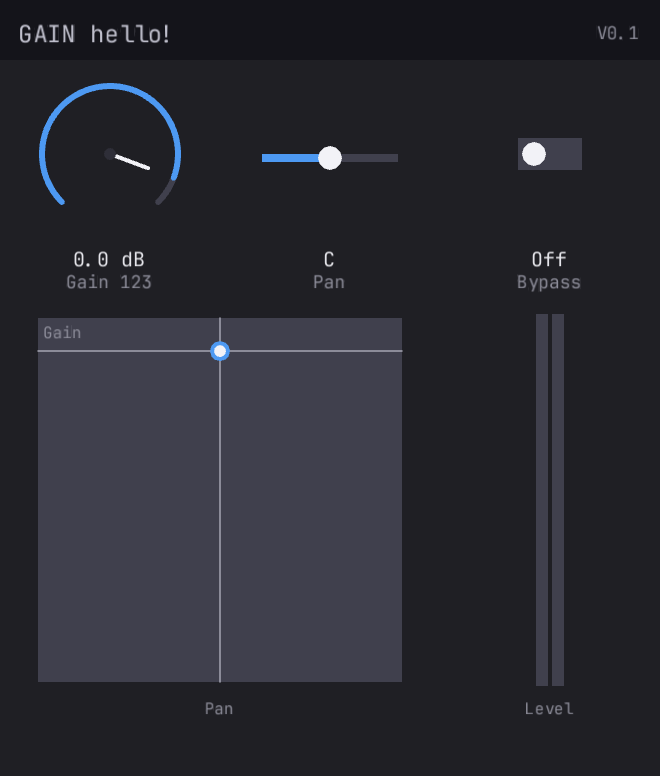

# truce

Build audio plugins in Rust. One codebase, every format.

[](LICENSE)

Write your plugin once. Build CLAP, VST3, VST2, AU v2, AU v3, AAX,
and standalone from a single Rust codebase. Hot-reload DSP and GUI
changes without restarting the DAW.



## Why truce?

| | truce | JUCE | nih-plug |
|---|---|---|---|
| Language | Rust | C++ | Rust |
| License | MIT / Apache-2.0 | AGPLv3 / $40-175/mo | ISC |
| CLAP | ✅ | Community only | ✅ |
| VST3 | ✅ | ✅ | ✅ |
| AU | ✅ (v2 + v3) | ✅ | ❌ |
| AAX | ✅ | ✅ | ❌ |
| VST2 | ✅ | Deprecated | ❌ |
| Hot reload | ✅ (`--features dev`) | ❌ | ❌ |
| Built-in GUI | ✅ (6 widget types) | ✅ (comprehensive) | BYO |
| Formats total | **6** | 4 | **2** |

## Quick Start

```sh
# Build and install all formats
cargo xtask install

# Or specific formats
cargo xtask install --clap
cargo xtask install --au3 -p gain

# Run tests
cargo xtask test
cargo xtask validate
```

## Minimal Example

```rust
use truce::prelude::*;

#[derive(Params)]
pub struct GainParams {
    #[param(id = 0, name = "Gain", range = "linear(-60, 6)",
            unit = "dB", smooth = "exp(5)")]
    pub gain: FloatParam,
}

pub struct Gain { params: GainParams }

impl PluginLogic for Gain {
    fn new() -> Self { Self { params: GainParams::new() } }

    fn params_mut(&mut self) -> Option<&mut dyn Params> {
        Some(&mut self.params)
    }

    fn reset(&mut self, sr: f64, _bs: usize) {
        self.params.set_sample_rate(sr);
    }

    fn process(&mut self, buffer: &mut AudioBuffer, _events: &EventList,
               _ctx: &mut ProcessContext) -> ProcessStatus {
        for i in 0..buffer.num_samples() {
            let gain = db_to_linear(self.params.gain.smoothed_next() as f64) as f32;
            for ch in 0..buffer.channels() {
                let (inp, out) = buffer.io(ch);
                out[i] = inp[i] * gain;
            }
        }
        ProcessStatus::Normal
    }

    fn layout(&self) -> PluginLayout {
        PluginLayout::build("GAIN", "V0.1", vec![
            KnobRow { label: None, knobs: vec![KnobDef::knob(0, "Gain")] },
        ], 80.0)
    }
}

truce::plugin! { logic: Gain, params: GainParams }
```

One import. One trait. One macro. That's a complete plugin with
smoothed params, a GUI knob, and CLAP + VST3 + AU exports.

## Hot Reload

Edit DSP or layout code, rebuild, hear the change in ~2 seconds.
No DAW restart. Same crate, same code — just a feature flag:

```bash
# One-time: build and install hot-reload shell
cargo xtask install --dev

# Iterate: rebuild the logic dylib (debug, fast)
cargo watch -x "build -p my-plugin"
```

Zero code changes between dev and release. The `dev` feature makes
`truce::plugin!` produce a hot-reload shell; without it, everything
compiles statically with zero overhead. See the
[hot reload guide](docs/reference/09-hot-reload.md).

## Format Support

| Format | Reaper | Logic | GarageBand | Ableton | FL Studio | Pro Tools |
|--------|--------|-------|------------|---------|-----------|-----------|
| CLAP   | ✅     |       |            |         |           |           |
| VST3   | ✅     |       |            | ✅      | ✅        |           |
| VST2   | ✅     |       |            | ✅      | ✅        |           |
| AU v2  | ✅     | ✅    | ✅         | ✅      |           |           |
| AU v3  |        | ✅    | ✅         | ✅      |           |           |
| AAX    |        |       |            |         |           | ✅        |

Custom knob GUI works in all formats. GarageBand does not show
custom GUI for any third-party plugin (Apple limitation).

## Examples

| Plugin | Type | What it demonstrates |
|--------|------|---------------------|
| [gain](examples/gain/) | Effect | Gain + pan + bypass, meters, XY pad, grid layout |
| [eq](examples/eq/) | Effect | 3-band parametric EQ, biquad filters |
| [synth](examples/synth/) | Instrument | 16-voice polyphonic, ADSR, filter, 4 waveforms |
| [transpose](examples/transpose/) | MIDI | Note transposition with stuck-note prevention |
| [arpeggio](examples/arpeggio/) | MIDI | Tempo-synced arpeggiator, 4 patterns |
| [passthru](examples/passthru/) | Effect | Minimal hello-world pass-through |

## Features

- **6 plugin formats** from one codebase (CLAP, VST3, VST2, AU v2, AU v3, AAX)
- **Hot reload** — edit DSP/layout, rebuild, hear changes without restarting the DAW
- **Built-in GUI** — knobs, sliders, toggles, selectors, meters, XY pads (tiny-skia CPU rendering, optional wgpu GPU backend via `--gpu` flag). TrueType font rendering (fontdue, JetBrains Mono)
- **Declarative params** — `#[derive(Params)]` + `#[param(...)]` with smoothing, ranges, units
- **`truce::plugin!`** — one macro generates all format exports + GUI + state serialization
- **`cargo xtask`** — build, bundle, sign, install, validate, clean
- **Zero-copy audio** — format wrappers pass host buffers directly
- **Thread-safe params** — atomic storage, lock-free access from any thread
- **Automated tests** — render, state, params, GUI snapshots, binary validation
- **All plugins pass auval + pluginval + clap-validator**

## Crate Structure

```
crates/
├── truce               # Facade (re-exports, plugin! macro)
├── truce-core          # Plugin, AudioBuffer, events, state
├── truce-params        # FloatParam, BoolParam, EnumParam, smoothing
├── truce-params-derive # #[derive(Params)] proc macro
├── truce-build         # build.rs helper (reads truce.toml)
├── truce-clap          # CLAP format wrapper
├── truce-vst3          # VST3 format wrapper
├── truce-vst2          # VST2 format wrapper (clean-room)
├── truce-aax           # AAX format wrapper
├── truce-au            # Audio Unit (v2 + v3)
├── truce-standalone    # Standalone host (cpal audio)
├── truce-gui           # Built-in GUI (tiny-skia + fontdue, optional wgpu GPU backend, 6 widget types)
├── truce-loader        # Hot-reload (native ABI, PluginLogic trait)
├── truce-xtask         # Build/bundle/install library (used by xtask)
├── truce-test          # Test utilities + GUI snapshot tests
├── cargo-truce         # Scaffolding CLI (cargo truce new)
```

## Documentation

**Guides:**
- [Quickstart](docs/quickstart.md) — zero to hearing your plugin in 5 minutes
- [Tutorials](docs/reference/) — parameters, processing, synth, GUI, hot reload (11 parts)
- [Hot Reload](docs/reference/09-hot-reload.md) — sub-second DSP iteration
- [Layout](docs/layout.md) — row and grid layouts, widget reference
- [Testing](docs/testing.md) — test utilities, assertions, validation
- [Validation](docs/validation.md) — auval, pluginval, clap-validator

**Reference:**
- [Design](docs/design.md) — framework architecture
- [Status](docs/status.md) — what's built, what's next
- API reference: `cargo doc --open`

## Configuration

Plugin metadata lives in `truce.toml`. Copy `truce.toml.example`
to get started:

```toml
[vendor]
name = "My Company"
id = "com.mycompany"
au_manufacturer = "MyCo"

[[plugin]]
name = "My Effect"
suffix = "effect"
crate = "my-effect"
au_type = "aufx"
au_subtype = "MyFx"
```

## Requirements

- Rust 1.75+ (`rustup update`)
- macOS: Xcode CLI tools (`xcode-select --install`). Full Xcode for AU v3.
- Windows: MSVC build tools (planned, macOS-first currently)
- AAX: Avid AAX SDK (optional, obtain from [developer.avid.com](https://developer.avid.com))

## License

MIT OR Apache-2.0
