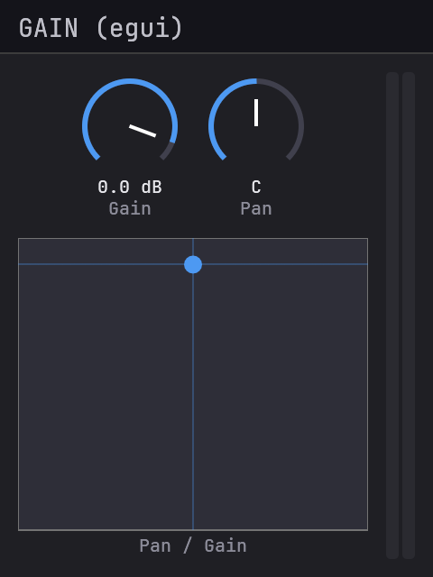
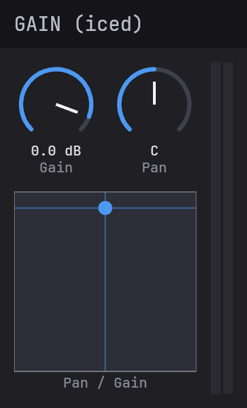
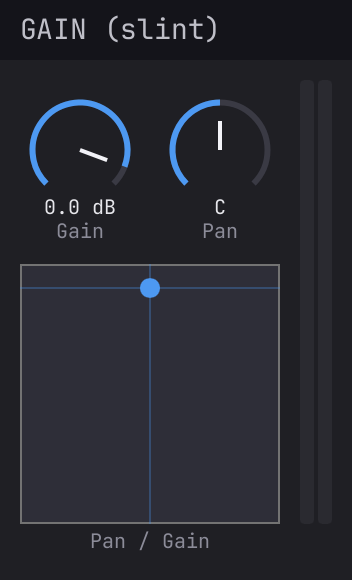

# Examples

Example plugins covering effects, instruments, MIDI processors, and
GUI framework integrations.

## Plugins

| Plugin | Type | GUI | Screenshot |
|--------|------|-----|-----------|
| [gain](truce-example-gain/) | Effect | Built-in |  |
| [eq](truce-example-eq/) | Effect | Built-in |  |
| [synth](truce-example-synth/) | Instrument | Built-in |  |
| [transpose](truce-example-transpose/) | MIDI | Built-in |  |
| [arpeggio](truce-example-arpeggio/) | MIDI | Built-in |  |
| [tremolo](truce-example-tremolo/) | Effect | egui |  |
| [gain-egui](truce-example-gain-egui/) | Effect | egui |  |
| [gain-iced](truce-example-gain-iced/) | Effect | Iced |  |
| [gain-slint](truce-example-gain-slint/) | Effect | Slint |  |

The four gain variants (gain, gain-egui, gain-iced, gain-slint) implement
the same plugin with different GUI frameworks. Compare them to see how
each framework handles the same layout.

## Out-of-tree

Larger examples live in their own repos — useful when you want to
see what truce looks like at the scale of a real plugin rather than
a 100-line teaching example.

| Plugin | What it shows |
|--------|---------------|
| [truce-analyzer](https://github.com/truce-audio/truce-analyzer) | Real-time spectrum analyzer with diff overlay; non-trivial GUI built on truce. |

## Building

```bash
cargo build --workspace                       # build all
cargo test --workspace                        # run all tests
cargo truce build                             # build every format into target/bundles/
cargo truce install -p truce-example-gain     # install one plugin
cargo truce run -p truce-example-synth        # run a plugin standalone
cargo truce validate -p truce-example-gain    # auval + pluginval + clap-validator
```

## Project structure

Each example follows the same layout:

```
examples/<name>/
├── Cargo.toml
└── src/
    └── lib.rs
```

GUI framework examples may have additional files:

```
examples/gain-slint/
├── build.rs              # slint-build compilation
└── ui/
    └── main.slint        # declarative UI markup
```
